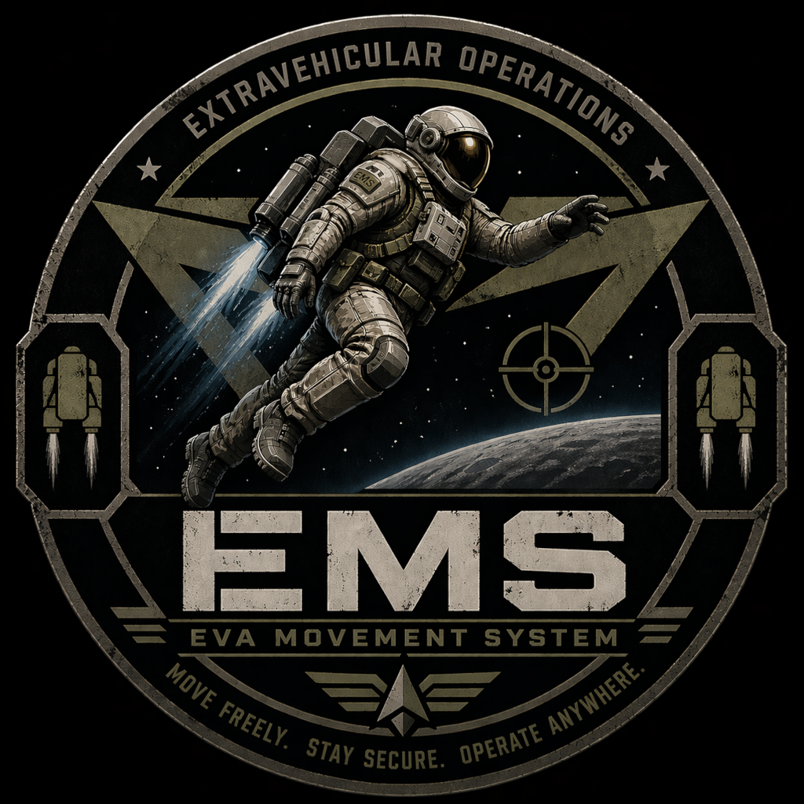

  <picture>
    <source media="(prefers-color-scheme: dark)" srcset="readme_data/EMS_1024.png">
    <source media="(prefers-color-scheme: light)" srcset="readme_data/EMS_1024.png">
    
  </picture>

  <h1 style="font-size: 2rem; font-weight: bold">EMS - Eva Movement System</h1>

  
  

# EMS

## General

Eva Movement System mod for Arma 3. 
It gives you the abiltity to set zero gravity zones and mark desired wearables class names as jetpack and space suit.

**NOTE: This mod does not add any custom/new items to the game. It provides the mechanics only.**

## Features

- Spacesuit mechanics
  - Ability to fly in space/zero gravity zones
  - Oxygen
     - Drained when using goggles
  - Fuel
     - Drained when flying 
- Jetpack mechanics
  - Using same fuel mechanics as space suit
- EDEN Modules for defining space/zero gravity zones
- Zeus Modules for refilling oxygen or fuel
- Fully configurable through addon settings

## Dependencies

**Required:**
- CBA_A3

**Optional:**
- ACE

## License

[GNU GENERAL PUBLIC LICENSE 3.0](https://github.com/Aquerr/ems/blob/main/LICENSE)
